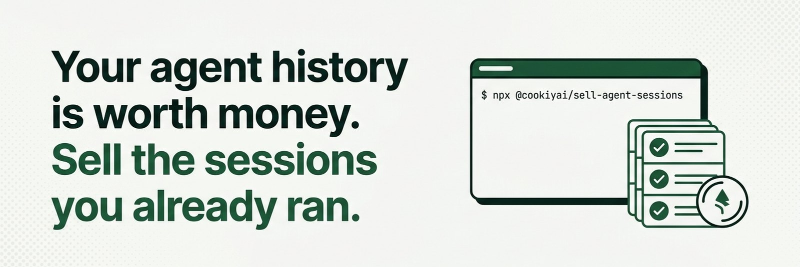
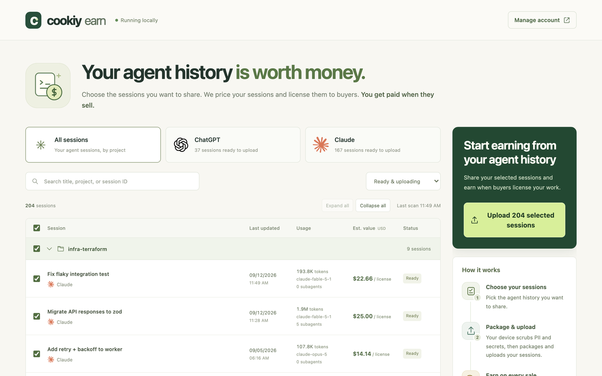
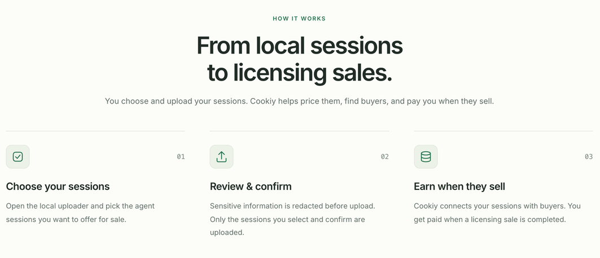
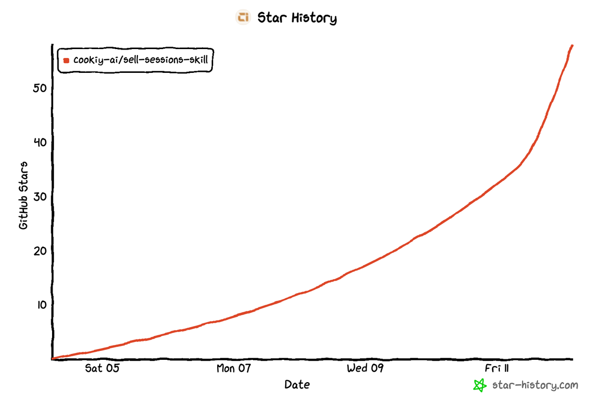

<!-- Part of the Cookiy sell-sessions skill · https://github.com/cookiy-ai/sell-sessions-skill -->

<p align="center">
  
</p>

<h1 align="center">Sell Your AI Agent Sessions</h1>

<p align="center">
  <b>The open-source skill that turns your Claude Code and Codex history into licensed, paid data.</b><br>
  Runs locally · You choose every session · Secrets and PII scrubbed on your machine · Paid on every sale
</p>

<p align="center">
  <a href="https://github.com/cookiy-ai/sell-sessions-skill/stargazers"></a>
  <a href="https://www.npmjs.com/package/@cookiyai/sell-agent-sessions"></a>
  
  
  <a href="LICENSE"></a>
</p>

<p align="center">
  <a href="https://earn.cookiy.ai/sell-sessions"><b>Website</b></a> ·
  <a href="#install">Install</a> ·
  <a href="#how-it-works">How it works</a> ·
  <a href="#privacy-by-design">Privacy</a> ·
  <a href="#faq">FAQ</a>
</p>

---

## One command. Your sessions. Your price.

```bash
npx @cookiyai/sell-agent-sessions
```

That opens a local web app on your machine that lists your Claude Code and Codex sessions, lets you pick the ones you want to license, scrubs secrets and PII before anything leaves your laptop, and shows you an estimated value per session. Installing or opening it uploads **nothing**.

<p align="center">
  
</p>

---

## Creators are talking about it 🎬

> Launched publicly on **September 10, 2026**. First creator video crossed **80K views in 4 days**.

<table>
  <tr>
    <td width="33%" valign="top">

https://github.com/user-attachments/assets/0ab62486-9bb6-4c0f-9514-fc6ab6e92193

<sub><b>@rishiexplainsai</b> · <a href="https://www.instagram.com/rishiexplainsai/reel/Dc_QiLkKmmv/">Instagram</a> · 82.4K views · 320 likes · 246 comments</sub>
</td>
    <td width="33%" valign="top">

https://github.com/user-attachments/assets/44567319-0b2f-478b-af5f-b95c43769f21

<sub><b>@rishiexplainsai</b> · <a href="https://www.instagram.com/rishiexplainsai/reel/DdCMWb2KRuu/">Instagram</a> · 5K+ views · posted this week</sub>
</td>
    <td width="33%" valign="top">

https://github.com/user-attachments/assets/7e09a2be-dde0-4144-9a16-6b6c54eb90e4

<sub><b>@rishiexplainsai</b> · new episode, going live this week</sub>
</td>
  </tr>
</table>

### What builders say after trying it

<table>
  <tr>
    <td width="25%" valign="top">

https://github.com/user-attachments/assets/f022482f-3686-4b0e-99d7-bd3ec57fc739

<sub>"Nothing goes without your approval. If you find something confidential, you just redact it."</sub>
</td>
    <td width="25%" valign="top">

https://github.com/user-attachments/assets/0312c0c5-d602-40da-80d7-062389a27df6

<sub>"Buyers aren't after random prompts. They want sessions from engineers who know what they're doing."</sub>
</td>
    <td width="25%" valign="top">

https://github.com/user-attachments/assets/19a56aea-22df-4ac0-89a3-2e7a5c5a3d21

<sub>"I'm the guy who reads every Terms page. Nothing is sent until you approve it yourself."</sub>
</td>
    <td width="25%" valign="top">

https://github.com/user-attachments/assets/cbb8fff3-895c-4e3e-892a-f71ce451645a

<sub>"I run infrastructure for a living. No daemons, no phone-home. Only what you approve gets sent."</sub>
</td>
  </tr>
  <tr>
    <td width="25%" valign="top">

https://github.com/user-attachments/assets/420f4438-909b-4b5b-a142-d8163ef2167b

<sub>"No new hours, no second job grind. The work is already finished."</sub>
</td>
    <td width="25%" valign="top">

https://github.com/user-attachments/assets/ec3e5c1a-16ed-44ec-b61a-0f629ac5f6d6

<sub>"I'm the paranoid friend who tapes his webcam, and even I signed off."</sub>
</td>
    <td width="25%" valign="top">

https://github.com/user-attachments/assets/e13dd45b-e8e2-48ae-a1a7-7618cd7c889e

<sub>"The valuable piece isn't the code. It's the corrections."</sub>
</td>
    <td width="25%" valign="top">

https://github.com/user-attachments/assets/b9f9a7f1-563f-4fe9-9002-22bd7a42f2b3

<sub>"900 sessions, 40 projects. I had no idea it ran this deep."</sub>
</td>
  </tr>
</table>

<p align="center"><sub>Batch 1 of the creator program: 20 videos, September 2026. 200 more in production.</sub></p>

---

## Why your sessions are worth money

Every session where you planned a task, corrected the model, ran tests and shipped is a worked example of how real engineering gets done. AI labs already train on this kind of data. Cookiy Earn lets **you** decide which sessions get licensed, and pays you for each sale.

| What buyers pay more for | Why |
|---|---|
| **Completed tasks** | A session that ends in working code is a full trajectory, not a fragment |
| **Human corrections** | Every time you overrode the model is a labeled judgment call |
| **Tests and verification** | Proof the outcome was checked, not just generated |
| **In-demand stacks** | Current frameworks, infra and languages buyers are actively sourcing |

<p align="center">
  
</p>

<sub>Estimates are shown before upload and are not offers. Actual prices are set when a licensing sale completes and depend on quality, difficulty, completeness, model, token volume and buyer demand. A session can earn again each time it is licensed to a new buyer.</sub>

---

## How it works

<p align="center">
  
</p>

1. **Choose your sessions.** The local uploader scans `~/.claude`, `~/.codex` and their platform equivalents and lists everything by project. You tick what to offer.
2. **Scrub and estimate, locally.** Detected secrets and PII are redacted on your device. Each session gets an estimated value before upload.
3. **Match and earn.** Cookiy licenses your sessions to buyers and pays you on every completed sale, including repeat sales of the same session.

---

## Privacy by design

- **Local first.** Session files never leave your machine until you select them and confirm.
- **Nothing on install.** Installing or opening the uploader does not upload anything.
- **Redaction before upload.** Secrets and personally identifiable information are detected and stripped on your device. You can review before confirming.
- **No background daemons, no phone-home.** The uploader is a plain local web app you can stop any time.
- **Open source, MIT.** Read the [skill](SKILL.md). Inspect the [uploader package](https://www.npmjs.com/package/@cookiyai/sell-agent-sessions).
- **Honest limits.** Automated scrubbing reduces risk a lot, but no scrubber catches everything. Review what you upload.

---

## Install

### Option 1: run the uploader directly

```bash
npx @cookiyai/sell-agent-sessions
```

Requires Node.js and npm. Opens `http://localhost:4318` in your browser.

### Option 2: install the skill into your agent

```bash
npx skills add cookiy-ai/sell-sessions-skill --global
```

Then tell Claude Code, Codex, Cursor or any skill-aware agent:

> I want to sell my agent sessions to earn income.

The agent explains the product, installs the uploader on your host machine and launches it for you.

### Option 3: paste this into your agent

> Follow https://github.com/cookiy-ai/sell-sessions-skill to install the skill and start the local session uploader for me.

---

## FAQ

<details>
<summary><b>Why would anyone pay for my sessions?</b></summary>
Real agent sessions show how models handle practical, multi-step work: planning, tool use, coding, debugging, corrections and final outcomes. Labs use them for training, evaluation and product improvement. Difficult, coherent, completed sessions are worth more than short or abandoned ones.
</details>

<details>
<summary><b>How much is a session worth?</b></summary>
The uploader shows an estimate per session before upload. Actual prices depend on quality, task difficulty, model, token volume, completeness, licensing terms and buyer demand. Estimates are not offers.
</details>

<details>
<summary><b>Does installing the uploader expose my data?</b></summary>
No. Installing or opening the uploader uploads nothing. Your sessions stay on your device until you select them and confirm.
</details>

<details>
<summary><b>What exactly gets uploaded?</b></summary>
Only the sessions you select and confirm, after local redaction. Selecting alone does not start an upload.
</details>

<details>
<summary><b>When do I get paid?</b></summary>
When a buyer completes a licensing purchase, not when you upload. A session may earn again if licensed to another buyer. Track submissions and earnings in your Cookiy Earn account.
</details>

<details>
<summary><b>Do I lose ownership?</b></summary>
You license selected sessions. Nothing is transferred automatically. Exclusivity, deletion, buyer rights, payout timing and taxes are covered by the current <a href="https://earn.cookiy.ai/sell-sessions">Cookiy Earn terms</a>.
</details>

<details>
<summary><b>Why do I need to install something?</b></summary>
Your history lives on your computer. The uploader needs local access to list sessions, let you choose, scrub private data, estimate value and transfer only what you selected.
</details>

---

## Star history

[](https://www.star-history.com/#cookiy-ai/sell-sessions-skill&Date)

---

## Part of Cookiy AI

Built by the team behind the [Cookiy User Research Skill](https://github.com/cookiy-ai/user-research-skill) (1.5K+ stars) and [Cookiy.ai](https://cookiy.ai), the agentic user-research platform.

## License

[MIT](LICENSE) — Cookiy AI
